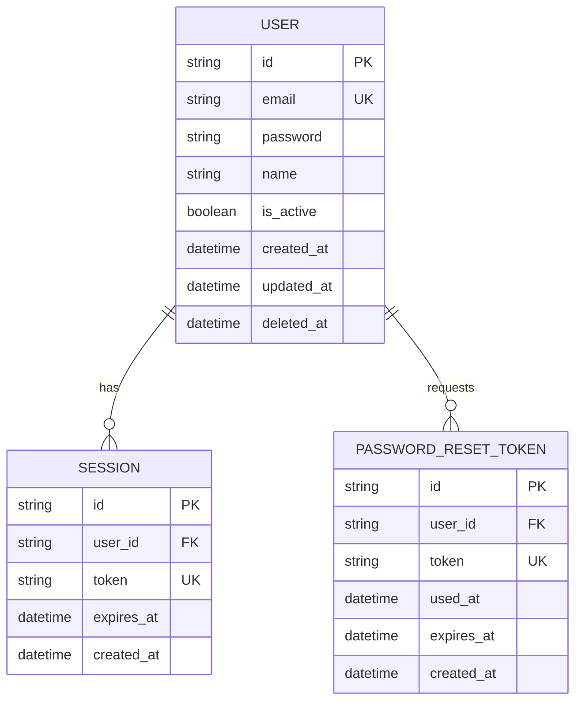

# Database Design Skill

## Core Principles

1. Design for correctness first, performance second
2. Prefer normalized schemas — denormalize only with evidence
3. Every table needs a primary key, created_at, and updated_at
4. Foreign keys must be declared — no implicit relationships
5. Migrations are always forward-only — never modify applied migrations
6. Never drop columns in a migration without a deprecation period
7. Always add indexes for foreign keys and common query patterns

---

## PostgreSQL + Prisma Conventions

### Table naming
- Lowercase, singular, snake_case: `user`, `post`, `password_reset_token`
- Junction tables: `user_role`, `post_tag` (alphabetical order)

### Column naming
- Primary key: `id` (CUID or UUID, not auto-increment for distributed systems)
- Timestamps: `created_at`, `updated_at` (auto-managed by Prisma)
- Foreign keys: `{table}_id` — e.g., `user_id`, `post_id`
- Boolean columns: `is_{state}` — e.g., `is_active`, `is_deleted`
- Soft delete: `deleted_at DateTime?` (null = active, timestamp = deleted)

### Prisma Schema Pattern
```prisma
// schema.prisma
generator client {
  provider = "prisma-client-js"
}

datasource db {
  provider = "postgresql"
  url      = env("DATABASE_URL")
}

model User {
  id         String    @id @default(cuid())
  email      String    @unique
  password   String    // bcrypt hash — never plain text
  name       String
  isActive   Boolean   @default(true)
  createdAt  DateTime  @default(now())
  updatedAt  DateTime  @updatedAt
  deletedAt  DateTime?

  posts      Post[]
  sessions   Session[]

  @@index([email])
  @@index([createdAt])
  @@map("user")
}

model Session {
  id        String   @id @default(cuid())
  userId    String
  token     String   @unique
  expiresAt DateTime
  createdAt DateTime @default(now())

  user      User     @relation(fields: [userId], references: [id], onDelete: Cascade)

  @@index([userId])
  @@index([token])
  @@index([expiresAt])
  @@map("session")
}

model PasswordResetToken {
  id        String   @id @default(cuid())
  userId    String
  token     String   @unique
  usedAt    DateTime?
  expiresAt DateTime
  createdAt DateTime @default(now())

  user      User     @relation(fields: [userId], references: [id], onDelete: Cascade)

  @@index([userId])
  @@index([token])
  @@map("password_reset_token")
}
```

---

## Migration Rules

### Creating a migration
```bash
npx prisma migrate dev --name {descriptive-name}
# Examples:
# npx prisma migrate dev --name add-user-table
# npx prisma migrate dev --name add-session-indexes
# npx prisma migrate dev --name add-post-soft-delete
```

### Safe migration checklist
- [ ] New table: always safe — proceed
- [ ] Add nullable column: safe — proceed
- [ ] Add NOT NULL column: requires default value or backfill migration
- [ ] Add index: safe on small tables; use `CREATE INDEX CONCURRENTLY` on large tables
- [ ] Rename column: BREAKING — use add-new + backfill + deprecate-old pattern
- [ ] Drop column: BREAKING — requires 2-release deprecation cycle
- [ ] Change column type: BREAKING — requires careful data migration

### Backfill pattern for NOT NULL columns
```sql
-- Migration 1: Add nullable
ALTER TABLE "user" ADD COLUMN "display_name" TEXT;

-- Migration 2: Backfill
UPDATE "user" SET "display_name" = "name" WHERE "display_name" IS NULL;

-- Migration 3: Add NOT NULL constraint
ALTER TABLE "user" ALTER COLUMN "display_name" SET NOT NULL;
```

---

## Index Design Rules

### Always index
- All foreign key columns
- Columns used in WHERE clauses in common queries
- Columns used in ORDER BY on large tables
- Unique constraints (auto-indexed by Postgres)

### Composite index rules
- Put the most selective column first
- Put the equality column before the range column
- Covering indexes for high-frequency read queries

### Index examples
```sql
-- Single column: user lookups by email
CREATE INDEX idx_user_email ON "user"(email);

-- Composite: posts by user, ordered by date
CREATE INDEX idx_post_user_created ON post(user_id, created_at DESC);

-- Partial index: only active sessions
CREATE INDEX idx_session_active ON session(user_id) WHERE expires_at > NOW();
```

---

## ER Diagram — Mermaid Format

Always produce an ER diagram for the schema plan:



---

## Query Optimization Rules

1. Never `SELECT *` — select only needed columns
2. Always paginate: `LIMIT n OFFSET m` or cursor-based for large datasets
3. Use `EXPLAIN ANALYZE` to verify index usage before merging
4. Prefer joins over N+1 queries — use Prisma `include`
5. For analytics/reporting: use read replicas or materialized views
6. Monitor slow queries: log queries > 100ms

### Prisma query patterns
```typescript
// Good: select only needed fields
const users = await prisma.user.findMany({
  select: { id: true, email: true, name: true },
  where: { isActive: true, deletedAt: null },
  orderBy: { createdAt: 'desc' },
  take: 20,
  skip: offset,
})

// Good: eager load relations (avoids N+1)
const posts = await prisma.post.findMany({
  include: { author: { select: { id: true, name: true } } },
  where: { publishedAt: { not: null } },
})

// Bad: N+1
const posts = await prisma.post.findMany()
for (const post of posts) {
  post.author = await prisma.user.findUnique({ where: { id: post.userId } })
  // This fires one query per post — use include instead
}
```

---

## Schema Plan Output Format

Produce: `pipeline/{feature}/04-schema-plan.md`

```markdown
# Schema Plan: {Feature Name}

## ER Diagram
{Mermaid diagram}

## New Tables
{List each new table with columns, types, constraints}

## Modified Tables
{List each changed table with before/after}

## Migrations
{List migrations in order with names and descriptions}

## Indexes
{List all indexes being added}

## Seed Data
{Any required seed/fixture data}

## Rollback Plan
{How to safely revert these migrations}

## Open Questions
{Any schema decisions that need confirmation}
```
